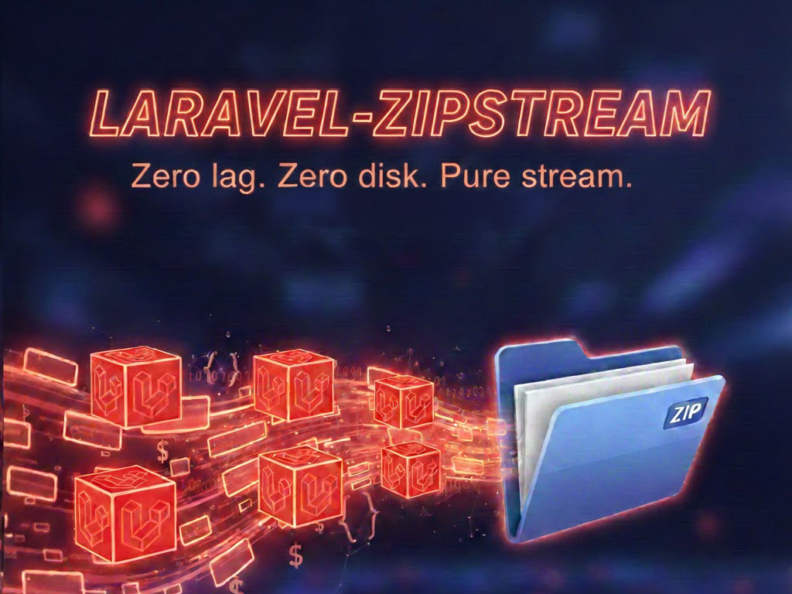

# Laravel ZipStream

A fluent Laravel wrapper for [maennchen/zipstream-php](https://github.com/maennchen/zipstream-php) to easily generate and stream ZIP archives.

## Installation

You can install the package via composer:

```bash
composer require exeque/laravel-zipstream
```

The service provider will automatically register itself.

## Basic Usage

The easiest way to use the library is via the `Zip` facade. You can fluently chain methods to add files and then generate a response or save the ZIP.

```php
use ExeQue\ZipStream\Facades\Zip;

return Zip::as('photos.zip')
    ->fromDisk('public', 'images/photo1.jpg')
    ->fromLocal('/path/to/local/file.pdf', 'invoice.pdf')
    ->fromRaw('notes.txt', 'Direct text content')
    ->toResponse();
```

## Adding Content

### From Laravel Disks
Add files stored on any of your configured Laravel filesystems.

```php
Zip::fromDisk('s3', 'exports/data.csv');

// With custom destination path in ZIP
Zip::fromDisk('s3', 'exports/data.csv', '2023/report.csv');
```

### From Local Path
Add files from the local filesystem.

```php
Zip::fromLocal('/tmp/temp-file.log');

// With custom destination path in ZIP
Zip::fromLocal('/tmp/temp-file.log', 'logs/system.log');
```

### From Raw Content
Add content directly from a string, resource, or stream.

```php
Zip::fromRaw('hello.txt', 'Hello World');
```

### From Custom Classes (Contracts)

You can implement `StreamableToZip` or `CanStreamToZip` on your custom classes (e.g., a `Media` model or `MediaCollection`) to easily add them to the ZIP archive.

#### StreamableToZip

The `StreamableToZip` contract is ideal for individual models that represent a file.

```php
use ExeQue\ZipStream\Contracts\StreamableToZip;
use Illuminate\Database\Eloquent\Model;
use Illuminate\Support\Facades\Storage;

class Media extends Model implements StreamableToZip
{
    public function stream()
    {
        // Return resource, string, StreamInterface, or a callable that returns one of these.
        return Storage::disk($this->disk)->readStream($this->path);
    }

    public function destination(): string
    {
        return "{$this->collection_name}/{$this->file_name}";
    }
}

Zip::add(Media::first());
```

#### CanStreamToZip

The `CanStreamToZip` contract is useful for classes that represent a collection of files, such as a `MediaCollection`.

```php
use ExeQue\ZipStream\Contracts\CanStreamToZip;
use Illuminate\Database\Eloquent\Collection;

class MediaCollection extends Collection implements CanStreamToZip
{
    public function getStreamableToZip(): iterable
    {
        return $this->all();
    }
}

$media = Media::where('collection_name', 'avatars')->get();
$collection = new MediaCollection($media);

Zip::add($collection);
```

### Empty Directories
Create an empty directory within the ZIP.

```php
Zip::emptyDirectory('backups');
```

## Customizing Files

You can pass a callback as the last argument to any of the `from*` methods to customize file-specific options.

```php
use ExeQue\ZipStream\Content\LocalFile;

Zip::fromLocal('/path/file.txt', 'file.txt', function (LocalFile $file) {
    $file->comment('This is a important file')
         ->deflate()
         ->deflateLevel(9);
});
```

## Extending the Builder (Macros)

The `Zip` facade and `Builder` class use the Laravel `Macroable` trait, allowing you to add custom functionality at runtime.

```php
use ExeQue\ZipStream\Facades\Zip;

Zip::macro('fromS3', function (string $path, ?string $destination = null) {
    return $this->fromDisk('s3', $path, $destination);
});

// Usage
Zip::fromS3('exports/report.pdf')->toResponse();
```

## Global ZIP Options

### Configuration
You can publish the config file to set global defaults:

```bash
php artisan vendor:publish --tag="laravel-zipstream-config"
```

Available options in `config/laravel-zipstream.php`:
- `default_compression_method`: "DEFLATE", "STORE", or null.
- `default_deflate_level`: 0-9.
- `enable_zero_header`: true or false.

### Fluent Configuration
Customize the ZIP options for a specific archive:

```php
Zip::as('archive.zip')
    ->store() // No compression
    ->withZeroHeader()
    ->fromLocal($file)
    ->toResponse();
```

## Output Options

### Stream to Browser (Response)
Returns a `Symfony\Component\HttpFoundation\StreamedResponse`.

```php
return Zip::as('download.zip')
    ->fromDisk('public', 'large-file.mp4')
    ->toResponse();
```

### Save to Local Path
```php
Zip::fromRaw('test.txt', 'content')
    ->saveToLocal('/path/to/save/archive.zip');
```

### Save to Laravel Disk
```php
Zip::fromRaw('test.txt', 'content')
    ->saveToDisk('s3', 'backups/today.zip');
```

### Get as String or Stream
```php
// Get as string
$content = Zip::fromRaw('a.txt', '...')->output();

// Get as PSR-7 Stream
$stream = Zip::fromRaw('a.txt', '...')->output(true);
```

## Testing

The package includes a comprehensive test suite. You can run the tests using Pest:

```bash
composer test
```

## License

The MIT License (MIT). Please see [License File](LICENSE.md) for more information.
