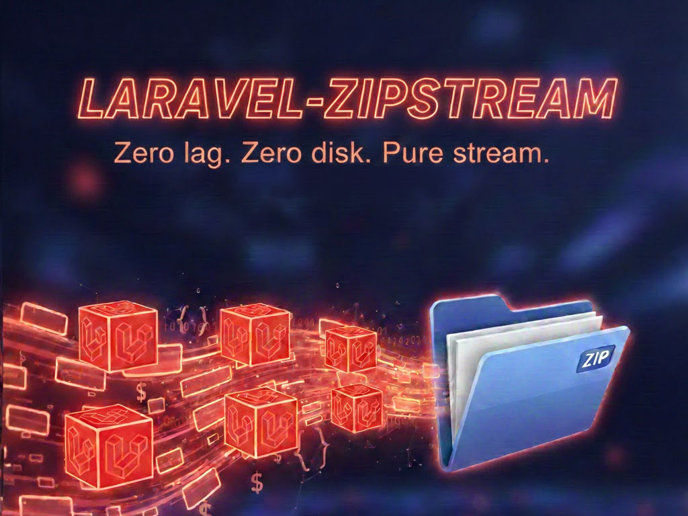

# Laravel ZipStream

A fluent Laravel wrapper for [maennchen/zipstream-php](https://github.com/maennchen/zipstream-php) to easily generate and stream ZIP archives.

## Installation

You can install the package via composer:

```bash
composer require exeque/laravel-zipstream
```

The service provider will automatically register itself.

## Basic Usage

The easiest way to use the library is via the `Zip` facade. You can fluently chain methods to add files and then generate a response or save the ZIP.

```php
use ExeQue\ZipStream\Facades\Zip;

return Zip::as('photos.zip')
    ->fromDisk('public', 'images/photo1.jpg')
    ->fromLocal('/path/to/local/file.pdf', 'invoice.pdf')
    ->fromRaw('notes.txt', 'Direct text content')
    ->toResponse();
```

## Adding Content

### From Laravel Disks
Add files stored on any of your configured Laravel filesystems.

```php
Zip::fromDisk('s3', 'exports/data.csv');

// With custom destination path in ZIP
Zip::fromDisk('s3', 'exports/data.csv', '2023/report.csv');
```

### From Local Path
Add files from the local filesystem.

```php
Zip::fromLocal('/tmp/temp-file.log');

// With custom destination path in ZIP
Zip::fromLocal('/tmp/temp-file.log', 'logs/system.log');
```

### From Raw Content
Add content directly from a string, resource, or stream.

```php
Zip::fromRaw('hello.txt', 'Hello World');
```

### From Custom Classes (Contracts)

You can implement `StreamableToZip` or `CanStreamToZip` on your custom classes (e.g., a `Media` model or `MediaCollection`) to easily add them to the ZIP archive.

#### StreamableToZip

The `StreamableToZip` contract is ideal for individual models that represent a file.

```php
use ExeQue\ZipStream\Contracts\StreamableToZip;
use Illuminate\Database\Eloquent\Model;
use Illuminate\Support\Facades\Storage;

class Media extends Model implements StreamableToZip
{
    public function stream()
    {
        // Return resource, string, StreamInterface, or a callable that returns one of these.
        return Storage::disk($this->disk)->readStream($this->path);
    }

    public function destination(): string
    {
        return "{$this->collection_name}/{$this->file_name}";
    }
}

Zip::add(Media::first());
```

#### CanStreamToZip

The `CanStreamToZip` contract is useful for classes that represent a collection of files, such as a `MediaCollection`.

```php
use ExeQue\ZipStream\Contracts\CanStreamToZip;
use Illuminate\Database\Eloquent\Collection;

class MediaCollection extends Collection implements CanStreamToZip
{
    public function getStreamableToZip(): iterable
    {
        return $this->all();
    }
}

$media = Media::where('collection_name', 'avatars')->get();
$collection = new MediaCollection($media);

Zip::add($collection);
```

### Empty Directories
Create an empty directory within the ZIP.

```php
Zip::emptyDirectory('backups');
```

## Customizing Files

You can pass a callback as the last argument to any of the `from*` methods to customize file-specific options.

```php
use ExeQue\ZipStream\Content\LocalFile;

Zip::fromLocal('/path/file.txt', 'file.txt', function (LocalFile $file) {
    $file->comment('This is a important file')
         ->deflate()
         ->deflateLevel(9);
});
```

### Entry Sizes

Telling the package how large an entry is turns a *silently truncated* file into a catchable
error. When a remote body (S3, HTTP) dies mid-read, `fread()` returns `''` rather than `false`,
the read loop simply ends, and the entry is closed as if it were complete. With `exactSize()`
set, `zipstream-php` throws `FileSizeIncorrectException` instead, which is routed to
`EventType::ProcessError` (see [Handling Errors](#handling-errors)).

```php
Zip::store()
    ->fromDisk('s3', $media->path, $media->name, function (DiskFile $file) use ($media) {
        $file->exactSize($media->size);
    });
```

- `Raw` defaults `exactSize` to `strlen()` when the content is a string.
- `LocalFile` defaults it to `filesize()`.
- `DiskFile` has **no** default — resolving it would cost a `HEAD` request per entry. Supply it
  from your own metadata, as above.
- `maxSize()` caps how much is read from an entry.
- Pass `null` to opt out (e.g. a log file that legitimately grows while it is being streamed).

> **Size limits only apply to stored entries.** `zipstream-php` ends its read loop as soon as
> `exactSize`/`maxSize` is reached, which happens *before* `feof()`, so `deflate_add()` is never
> called with `ZLIB_FINISH` and the buffered compressed tail is dropped. To avoid producing empty
> entries, both values are ignored unless the entry's effective compression method is
> `CompressionMethod::STORE`. Use `->store()` when you want short-read detection — which is the
> right choice for already-compressed media anyway.

## Extending the Builder (Macros)

The `Zip` facade and `Builder` class use the Laravel `Macroable` trait, allowing you to add custom functionality at runtime.

```php
use ExeQue\ZipStream\Facades\Zip;

Zip::macro('fromS3', function (string $path, ?string $destination = null) {
    return $this->fromDisk('s3', $path, $destination);
});

// Usage
Zip::fromS3('exports/report.pdf')->toResponse();
```

## Global ZIP Options

### Configuration
You can publish the config file to set global defaults:

```bash
php artisan vendor:publish --tag="laravel-zipstream-config"
```

Available options in `config/laravel-zipstream.php`:
- `default_compression_method`: "DEFLATE", "STORE", or null.
- `default_deflate_level`: 0-9.
- `enable_zero_header`: true or false.

### Fluent Configuration
Customize the ZIP options for a specific archive:

```php
Zip::as('archive.zip')
    ->store() // No compression
    ->withZeroHeader()
    ->fromLocal($file)
    ->toResponse();
```

## Output Options

### Stream to Browser (Response)
Returns a `Symfony\Component\HttpFoundation\StreamedResponse`.

```php
return Zip::as('download.zip')
    ->fromDisk('public', 'large-file.mp4')
    ->toResponse();
```

The response is streamed and flushed as it is produced, so bytes reach the client immediately
rather than sitting in an output buffer.

#### Content-Length

By default the response is chunked. Opt in to a real `Content-Length` — which lets clients show
progress and detect a truncated archive — with `withContentLength()`:

```php
return Zip::as('download.zip')
    ->store()
    ->withContentLength()
    ->fromDisk('s3', $media->path, $media->name, fn (DiskFile $f) => $f->exactSize($media->size))
    ->toResponse();
```

The size is computed by replaying the archive in `OperationMode::SIMULATE_STRICT`, which performs
no I/O at all. It only succeeds when **every** entry uses `CompressionMethod::STORE` *and* has a
known `exactSize` (see [Entry Sizes](#entry-sizes)). When it cannot be determined, the header is
silently omitted and the response falls back to chunked.

#### Streaming from S3

Laravel defaults S3 disks to `'stream_reads' => false`. Flysystem then omits `@http.stream`, and
Guzzle buffers each whole object in memory before `readStream()` returns. Every entry becomes a
long stall with zero bytes sent — which is exactly what trips `fastcgi_read_timeout` and kills
large downloads mid-transfer. Enable real streaming on any S3 disk used with this package:

```php
// config/filesystems.php
's3' => [
    'driver'       => 's3',
    // ...
    'stream_reads' => true,
],
```

### Save to Local Path
```php
Zip::fromRaw('test.txt', 'content')
    ->saveToLocal('/path/to/save/archive.zip');
```

### Save to Laravel Disk
```php
Zip::fromRaw('test.txt', 'content')
    ->saveToDisk('s3', 'backups/today.zip');
```

### Get as String or Stream
```php
// Get as string
$content = Zip::fromRaw('a.txt', '...')->output();

// Get as PSR-7 Stream
$stream = Zip::fromRaw('a.txt', '...')->output(true);
```

## Events

Register handlers via `on()` to observe or react to what happens during streaming.

```php
use ExeQue\ZipStream\Events\EventType;
use ExeQue\ZipStream\Facades\Zip;

Zip::as('archive.zip')
    ->on(EventType::ProcessStarted, fn (string $id) => Log::info("Zip $id started"))
    ->on([EventType::StreamingFile, EventType::StreamedFile], function ($file, $options, string $id) {
        // fires before/after each file
    })
    ->fromDisk('public', 'images/photo1.jpg')
    ->toResponse();
```

`EventType::Any` matches every event. Available types: `ProcessStarted`, `ProcessFinished`, `ProcessAborted`, `ProcessError`, `StreamingDirectory`/`StreamedDirectory`, `StreamingFile`/`StreamedFile`, `StreamingToZip`/`StreamedToZip`, `SavingToDisk`/`SavedToDisk`, `SavingToFilesystem`/`SavedToFilesystem`, `StreamingResponse`/`StreamedResponse`, `Any`.

### Handling Errors

If streaming an entry throws (e.g. a file that disappeared on disk between verification and streaming), the exception is passed to any handler registered for `ProcessError`. If no handler is registered, the exception is simply thrown. A handler is responsible for re-throwing if it wants processing to stop; otherwise, processing continues with the next entry.

```php
use ExeQue\ZipStream\Events\EventType;
use ExeQue\ZipStream\Exceptions\FileUnavailableException;
use Throwable;

Zip::as('archive.zip')
    ->on(EventType::ProcessError, function (Throwable $e, string $id) {
        if (!$e instanceof FileUnavailableException) {
            throw $e; // abort on anything unexpected
        }

        report($e); // log and skip the missing file
    })
    ->fromDisk('public', 'images/photo1.jpg')
    ->toResponse();
```

`DiskFile::stream()` and `LocalFile::stream()` throw `FileUnavailableException` (carrying the failing `$entry`) if the underlying disk/filesystem fails to open a read stream, even after passing verification.

## Testing

The package includes a comprehensive test suite. You can run the tests using Pest:

```bash
composer test
```

## License

The MIT License (MIT). Please see [License File](LICENSE.md) for more information.
